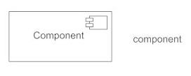
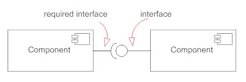
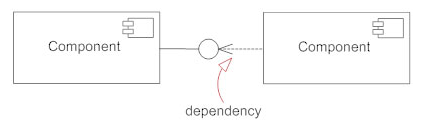
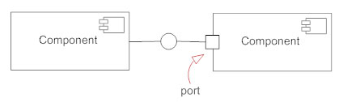

# **I. Component Diagram (UML component diagram)**

**Source:** [https://www.smartdraw.com/component-diagram/](https://www.smartdraw.com/component-diagram/)

**Advanced:** [visual-paradigm - What is component diagram?](https://www.visual-paradigm.com/guide/uml-unified-modeling-language/what-is-component-diagram/)

## **1. Definition**

- Describes the org & wiring physical components in a system
- Helps implementing details of the model
- Helps double-check all aspects of the systems' required function is covered by planned development
- Components are:
  - Physical (UML version 1): docs, db tables, files, executables, physical elements with a location.
  - More conceptual stand-alone (UML version 2): **_business process_** provides/requires **_interfaces_** to interact with **_other constructs_** in the system, **_multiple physical_** artifacts if they naturally belong together (physical elements in UML referred as artifacts).

## **2. Symbols & Notations**

### **2.1. Component**

- Logical unit block of the system.
- Slightly higher abstraction than classes.
- Represented as a rectangle with a smaller rectangle in the upper right corner with tab of the word written above the name of the component to help distinguish it from a class.

### **2.2. Interface**

- Small circle or semi-circle on a stick.
- Describes group of operations used (required) or created (provided) by components.
- Full circle represents an interface created or provided by the component.
- Semi-circle represents a required interface, like a person's input.

### **2.3. Dependencies**

- Represented by dashed arrow.
- E.g. **A** depends on **B**: the head of arrow points to **B**

### **2.4. Port**

- Represented using a square along the edge of the system or a component.
- Help exposes required/provided interfaces of a component.

## **3. Comparison**

- Package diagram:
  - Package diagram elements are always public, while component diagram elements are private.
